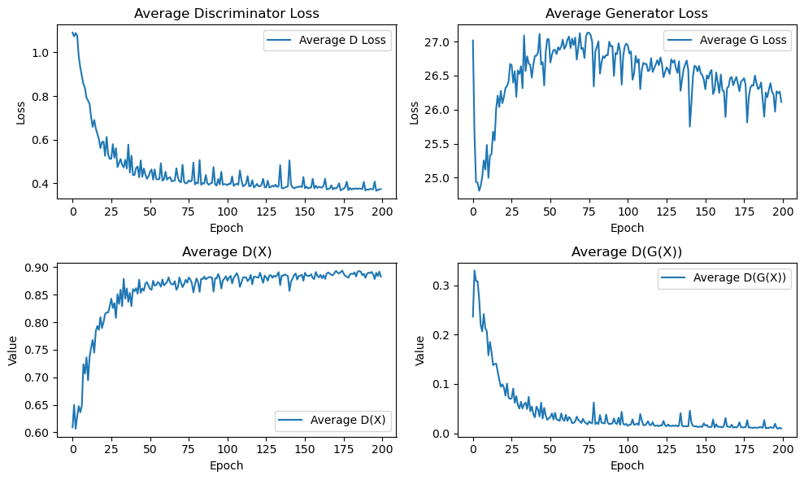

# DCGAN-Text-to-Image
The goal of this project is to generate 64x64 pixel flower images based on single sentence text descriptions. This project is based on the paper “Generative Adversarial Text to Image Synthesis” by Reed et al., which utilizes deep convolutional generative adversarial network (DCGAN) to translate single-sentence human written descriptions directly into image pixels.

## Downloads
- [Oxford 102 flowers image dataset](https://www.robots.ox.ac.uk/~vgg/data/flowers/102/)
- [cvpr2016_flowers.tar.gz](https://drive.google.com/file/d/0B0ywwgffWnLLcms2WWJQRFNSWXM/view?resourcekey=0-Av8zFbeDDvNcF1sSjDR32w) obtain text_c10
- [flowers_icml.tar.gz](https://drive.google.com/file/d/0B0ywwgffWnLLMl9uOU91MV80cVU/view?resourcekey=0-vy4hVV-6Hvpw3AiYipoa3g)
- Run convert_flowers_to_hd5_script.py to obtain the flowers.hdf5 file

## Repository and Code Structure
```bash
DCGAN-Text-to-Image/
  |-- convert_flowers_to_hd5_script.py
  |-- trainer.py
  |-- runtime.py
  |-- txt2image_dataset.py
  |-- utils.py
  |-- flowers.hdf5
  |-- models
    |-- gan.py
    ......
  |-- 102flowers/
    |-- jpg/
        |-- image_00001.jpg
        |-- image_00002.jpg
        |-- image_00003.jpg
        ......
    |-- text_c10
        |-- class_00001
        |-- class_00002
        |-- class_00003
        ......
    |-- flowers_icml/
        |-- trainclasses.txt
        |-- valclasses.txt
        |-- testclasses.txt
        |-- class_00001
        |-- class_00002
        |-- class_00003
        ......
```

## Commands to Execute the Code
To run train():
```bash
python runtime.py
```

To run predict():
```bash
python runtime.py --inference --pre_trained_disc ./checkpoints/disc_190.pth --pre_trained_gen ./checkpoints/gen_190.pth
```

## Graphs


## Results
| Text | Image |
|------|-------|
| 1. a flower with large rounded pink petals and a large white pistil. |  |
| 2. a flower that has long and narrow petals that are yellow. |  |
| 3. a dark brown circular base of pistil is surrounded by many long oblong whitish petals. |  |
| 4. a flower with long and narrow petals that are white. |  |
| 5. a flower with long and narrow petals that are bright red. |  |
| 6. this flower has petals that are white and has purple stripes. |  |
| 7. this flower has purple petals and a lot of purple stamen and anthers on it. |  |
| 8. this flower has two layers of petals, one with large pale yellow petals and the inner one with darker petals that fold away from the center. |  |
| 9. this flower is pink in color, and has petals that are closely wrapped around the ovary. |  |
| 10. this pale-looking flower has large yellow petals and is wilting. |  |
| 11. this flower has five light blue petals with a deep purple streak in the middle of the petal. |  |

<p float="left">
  
   
</p>
epoch 0

<p float="left">
  
   
</p>
epoch 10

<p float="left">
  
   
</p>
epoch 199

## References
1) [https://arxiv.org/abs/1605.05396](https://arxiv.org/abs/1605.05396)
2) [https://github.com/aelnouby/Text-to-Image-Synthesis](https://github.com/aelnouby/Text-to-Image-Synthesis)
